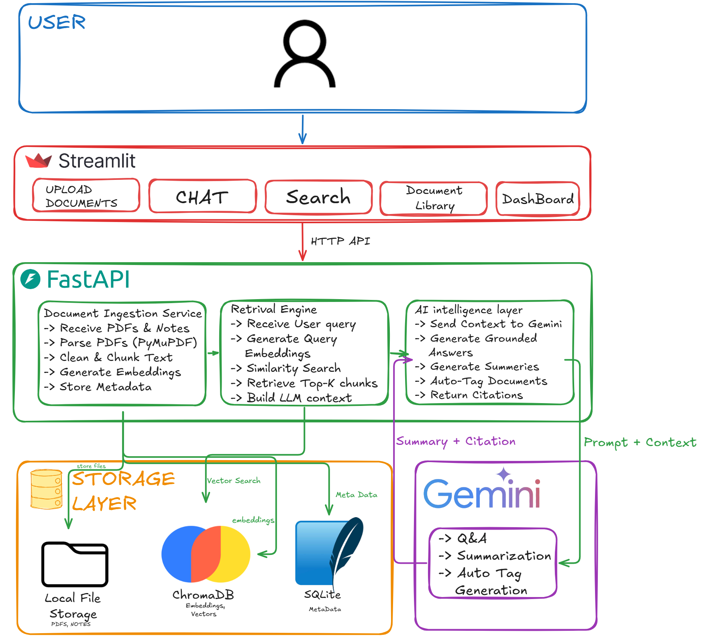
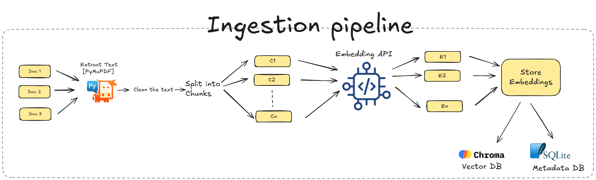
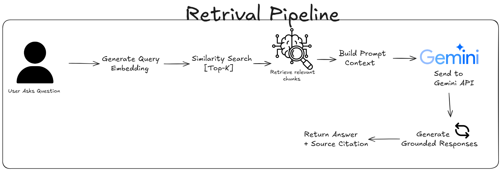

# 🧠 Second Brain AI

<p align="center">
  
</p>

An AI-powered Personal Knowledge Management (PKM) system that transforms your documents and notes into a searchable, conversational knowledge base using Retrieval-Augmented Generation (RAG).

Upload PDFs or notes, search semantically, chat with your knowledge, generate summaries, and organize information—all in one place.

---

## ✨ Features

- 📄 Upload PDF documents
- 📝 Create and store notes
- 🔍 Semantic search across all knowledge
- 💬 Chat with your documents using RAG
- 📚 Source citations for every response
- 📖 AI-generated document summaries
- 🏷️ Automatic document tagging
- 📊 Dashboard with knowledge base statistics
- 🗂️ Document management (view, list, delete)

---

## 🏗️ System Architecture

To understand the core mechanics of the **Second Brain AI** platform, review the architecture and data flow diagrams detailed below:

### 🌐 High-Level System Architecture
The overall architecture maps the interaction between the Streamlit UI frontend, the FastAPI backend ecosystem, and the underlying storage engines (SQLite & ChromaDB).



---

### 📥 Ingestion Pipeline
The ingestion framework handles document parsing, chunking strategy via LangChain, embedding generation, and simultaneous population of relational metadata and vector storage.



---

### 🔍 Retrieval Pipeline
The query processing and RAG execution flow—spanning semantic vector search, context synthesis, prompt formatting, and final response generation using Google Gemini.




## ⚙️ Tech Stack

### Frontend
- Streamlit

### Backend
- FastAPI
- Uvicorn

### AI & RAG
- Google Gemini
- sentence-transformers
- LangChain Text Splitter

### Databases
- ChromaDB
- SQLite
- SQLAlchemy

### PDF Processing
- PyMuPDF

---

## 📂 Project Structure

```
backend/
├── api/
├── services/
├── ingestion/
├── retrieval/
├── intelligence/
├── database/
├── vectorstore/
├── utils/
└── main.py

frontend/
└── app.py

data/
├── uploads/
└── chroma_db/
```

---

## 🔄 RAG Pipeline


## 🚀 Running the Project

### Clone

```bash
git clone <repository-url>
cd second-brain-ai
```

### Install Dependencies

```bash
pip install -r requirements.txt
```

### Configure Environment

Create a `.env` file:

```env
GEMINI_API_KEY=your_api_key
```

### Start Backend

```bash
cd backend
uvicorn main:app --reload
```

### Start Frontend

```bash
cd frontend
streamlit run app.py
```

---

## 📡 API Overview

| Endpoint | Description |
|----------|-------------|
| POST `/upload` | Upload a PDF |
| POST `/notes` | Create a note |
| POST `/chat` | Chat with knowledge base |
| POST `/search` | Semantic search |
| GET `/documents` | List documents |
| GET `/documents/{id}` | Document details |
| DELETE `/documents/{id}` | Delete document |
| GET `/dashboard` | Dashboard statistics |
| GET `/health` | Health check |

---

## 📊 Current Capabilities

- ✅ PDF ingestion
- ✅ Note ingestion
- ✅ Text extraction
- ✅ Chunking
- ✅ Local embeddings
- ✅ ChromaDB integration
- ✅ SQLite metadata
- ✅ Semantic search
- ✅ RAG chat
- ✅ AI summaries
- ✅ Auto-tagging
- ✅ Dashboard
- 🚧 Streamlit frontend integration

---

## 🔮 Future Enhancements

- Re-ranking for improved retrieval
- Knowledge Graph visualization
- Hybrid search (Keyword + Vector)
- OCR support for scanned PDFs
- Multi-user authentication
- Docker deployment
- Cloud storage support

---

## 🛡️ Error Handling

- Graceful fallback when Gemini API is unavailable
- Metadata consistency between SQLite and ChromaDB
- End-to-end ingestion pipeline validation
- Modular architecture for maintainability

